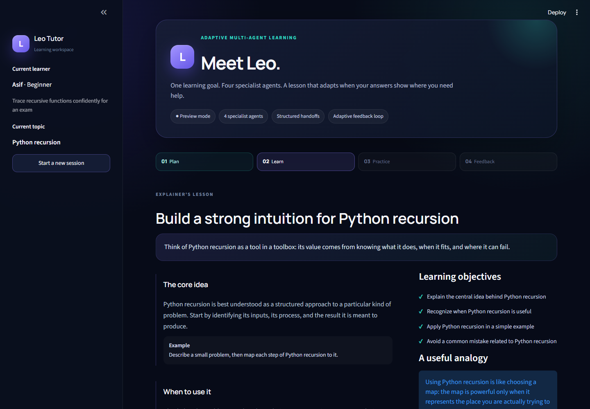
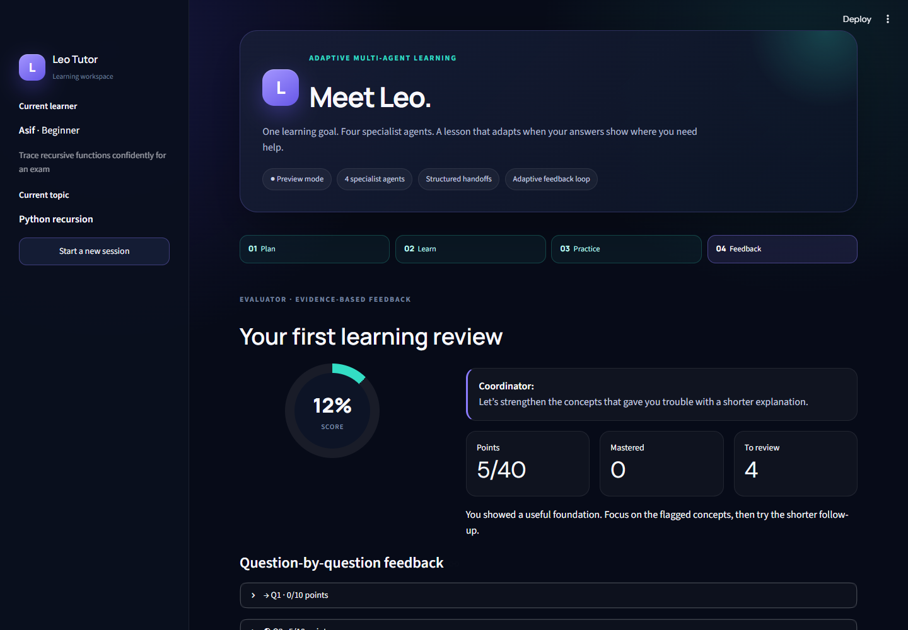
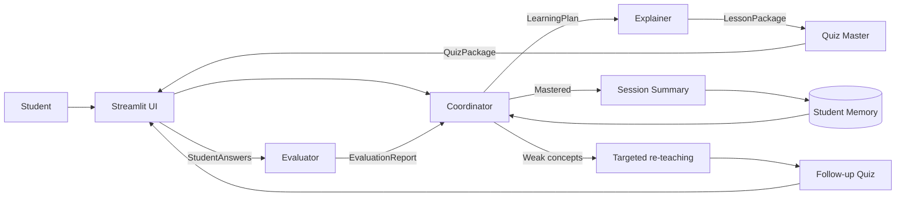

<div align="center">

# Leo — Adaptive Multi-Agent AI Tutor

**A study session designed by four collaborating AI specialists, not one generic chatbot.**

Built with CrewAI, typed handoffs, persistent learner memory, and an adaptive re-teaching loop.

[](https://www.python.org/)
[](https://www.crewai.com/)
[](https://streamlit.io/)
[](https://github.com/MdAsif-Hossain/Multi-Agent-AI-Tutor/actions/workflows/ci.yml)
[](https://github.com/user-attachments/assets/64483244-c83e-474c-b570-52f426661e86)

[Demo](#demo) · [Architecture](#architecture) · [Run locally](#run-locally) · [Testing](#testing) · [Assignment coverage](#assignment-coverage)

</div>

## Demo

https://github.com/user-attachments/assets/64483244-c83e-474c-b570-52f426661e86

> See four specialist agents plan, teach, quiz, evaluate, and adapt in one complete session.

## What makes Leo different

Leo turns a learning request into an observable multi-agent workflow:

1. The **Coordinator** validates the request, recalls learner history, and delegates objectives.
2. The **Explainer** receives that plan and produces an adaptive lesson.
3. The **Quiz Master** receives the plan and lesson, then creates a private-answer-key quiz.
4. The **Evaluator** grades the student's answers against question-specific rubrics.
5. The **Coordinator** reviews the evidence and either completes the session or starts targeted re-teaching.

The app displays high-level orchestration events and typed handoffs without exposing private model reasoning.

## Screens

| Adaptive lesson | Evaluation and feedback loop |
|---|---|
|  |  |

## Agent design

| Agent | Owns | Does not do |
|---|---|---|
| Coordinator | Request validation, learning plan, delegation, recovery, routing | Write the full lesson or grade answers |
| Explainer | Level-aware teaching, examples, analogies, misconceptions | Create scores or change the learning goal |
| Quiz Master | Structured practice based only on taught material | Reveal answer keys before submission |
| Evaluator | Rubric-based scoring, partial credit, concept-level feedback | Introduce unrelated concepts |

Every role has a distinct goal, backstory, behavioral boundary, and output contract in [`agents.yaml`](src/leo/config/agents.yaml). Task-specific prompt templates live in [`tasks.yaml`](src/leo/config/tasks.yaml).

## Architecture

Leo uses a **sequential orchestration pattern with a conditional feedback loop**. CrewAI tasks pass explicit context forward, while Python enforces grading totals, routing thresholds, and loop limits.

Delegation is intentionally explicit: the Coordinator produces the `LearningPlan`, and the sequential process assigns that validated handoff to the Explainer. CrewAI's open-ended delegation tools stay disabled so an agent cannot skip, duplicate, or reorder the graded workflow.



### Real handoffs

The workflow passes validated Pydantic models instead of loosely formatted text:

```text
StudentProfile + prior memory
    → LearningPlan
    → LessonPackage
    → QuizPackage
    → StudentAnswers
    → EvaluationReport
    → RoutingDecision
```

Question IDs survive the Quiz Master → Evaluator handoff. The application hides `correct_answer`, `explanation`, and `scoring_guide` fields from the student-facing quiz while keeping them available to the Evaluator.

## Adaptive feedback loop

When the first attempt scores below 70% or contains weak concepts:

```text
Evaluator identifies weak concepts
    → Coordinator selects re-teaching
    → Explainer creates a shorter targeted lesson
    → Quiz Master creates two fresh follow-up questions
    → Evaluator checks the second attempt
```

The loop is capped at one remediation cycle. This prevents an agent from stalling the session or creating an infinite retry loop.

## Memory

Leo stores per-student session summaries in local SQLite:

- Student name and level
- Topic and learning goal
- Final score
- Mastered concepts
- Weak concepts
- Session timestamp

The Coordinator receives the last three session summaries as prompt context. Returning learners therefore influence future planning instead of seeing memory only as a decorative history list.

## Reliability and safety

- Pydantic validation for every agent handoff
- Unique and traceable question IDs
- Deterministic score calculation in Python
- Maximum two structured-output retries
- Bounded agent iterations and execution time
- Clear clarification path for ambiguous topics
- Preserved form state after recoverable failures
- API keys loaded only from environment variables
- Preview mode clearly separated from live CrewAI mode
- No private chain-of-thought rendered in the interface

## Technology

- Python 3.12
- CrewAI 1.15.8
- Streamlit 1.60
- Gemini 3.1 Flash-Lite by default, with Groq fallback
- Pydantic 2
- SQLite from the Python standard library
- Pytest and Streamlit AppTest
- GitHub Actions

The versions above are the versions used during final verification. Compatible ranges are recorded in [`requirements.txt`](requirements.txt).

## Run locally

### 1. Create an environment

```bash
python -m venv .venv
```

Windows:

```powershell
.\.venv\Scripts\Activate.ps1
```

macOS or Linux:

```bash
source .venv/bin/activate
```

### 2. Install dependencies

```bash
pip install -r requirements.txt
```

### 3. Configure the model

Copy `.env.example` to `.env` and add your own provider key:

```env
LEO_MODEL=gemini/gemini-3.1-flash-lite
GEMINI_API_KEY=your_key_here
```

Gemini 3.1 Flash-Lite is Leo's default because it is stable, supports structured
output, and is available on the Gemini free tier. Create a key in
[Google AI Studio](https://aistudio.google.com/app/apikey).

To use Groq instead:

```env
LEO_MODEL=groq/openai/gpt-oss-120b
GROQ_API_KEY=your_key_here
```

Create the alternative key in the [Groq console](https://console.groq.com/keys).
Both services enforce free-tier rate limits. Never commit `.env`; it is already
ignored by Git.

### 4. Start Leo

```bash
streamlit run app.py
```

Open `http://localhost:8501`.

### Preview without a key

Keep **Preview without an API key** enabled in the sidebar. Preview mode runs a deterministic sample workflow so reviewers can inspect the complete UI, handoff timeline, grading dashboard, and feedback loop.

Preview output must not be presented as a live model run. For the assignment video, disable preview mode and use a configured CrewAI model.

## Testing

Install the development dependencies and run:

```bash
pip install -r requirements-dev.txt
pytest -q
```

The test suite verifies:

- Quiz schema and unique IDs
- Deterministic grading totals
- Bounded remediation routing
- All four agent handoffs
- Persistent case-insensitive learner memory
- A full Streamlit session through both quiz attempts

CI also compiles the source before running the tests.

## Project structure

```text
.
├── app.py                       # Streamlit interface and session state
├── src/leo/
│   ├── engine.py                # CrewAI orchestration and preview adapter
│   ├── models.py                # Typed handoff contracts and routing rules
│   ├── storage.py               # Durable SQLite student memory
│   └── config/
│       ├── agents.yaml          # Per-role prompts and behavior
│       └── tasks.yaml           # Task prompts and expected outputs
├── tests/                       # Unit and full Streamlit workflow tests
├── docs/
│   ├── screenshots/
│   └── demo-script.md
├── .github/workflows/ci.yml
├── .env.example
└── requirements.txt
```

## Demo walkthrough

[Watch the complete recorded walkthrough](https://github.com/user-attachments/assets/64483244-c83e-474c-b570-52f426661e86).
The recording is hosted as a GitHub issue attachment and demonstrates Leo's
complete workflow:

- All four agent turns
- Typed handoffs
- Human checkpoint
- Intentionally weak answers
- Automatic targeted re-teaching
- Follow-up evaluation
- Persistent learner memory

The accompanying [demo script](docs/demo-script.md) provides the presentation
outline:

| Time | What to show |
|---|---|
| 0:00–0:30 | Problem, interface, and four specialist roles |
| 0:30–1:30 | Student profile, topic selection, and Coordinator handoff |
| 1:30–2:30 | Explainer lesson and Quiz Master questions |
| 2:30–3:45 | Evaluator feedback and targeted re-teaching loop |
| 3:45–5:00 | Follow-up result, memory, architecture, and repository |

## Assignment coverage

| Criterion | Evidence |
|---|---|
| 4+ agent roles | Four behaviorally distinct CrewAI agents |
| Orchestration and handoffs | Sequential CrewAI tasks, typed contexts, visible event timeline |
| Framework | CrewAI agents, crews, tasks, LLM configuration, structured output |
| Memory and prompts | SQLite learner memory plus YAML templates per role |
| Output quality | Coherent plan → lesson → quiz → evaluation → remediation |
| Interface | Custom responsive Streamlit learning dashboard |
| Code and README | Tests, CI, Mermaid architecture, setup and security documentation |
| Demo | Recorded full-session walkthrough plus timed presentation script |
| Bonus | Evaluator-driven re-teaching loop and human pacing checkpoint |

## Limitations

- AI-generated lessons and evaluations can be wrong; important academic facts should be checked against trusted sources.
- Local SQLite memory is designed for a single-machine demo. A multi-user deployment should use an external managed database.
- Preview mode validates product behavior and presentation, not model quality.
- The first release intentionally excludes web search to keep the graded workflow focused and auditable.

## Resume-ready description

> Built an adaptive multi-agent tutoring system with CrewAI and Streamlit, coordinating specialized planning, teaching, quiz-generation, and evaluation agents through typed handoffs. Implemented persistent learner memory, deterministic rubric scoring, and an evaluator-driven re-teaching loop, with automated end-to-end UI tests and CI.

## License

MIT — see [`LICENSE`](LICENSE).
