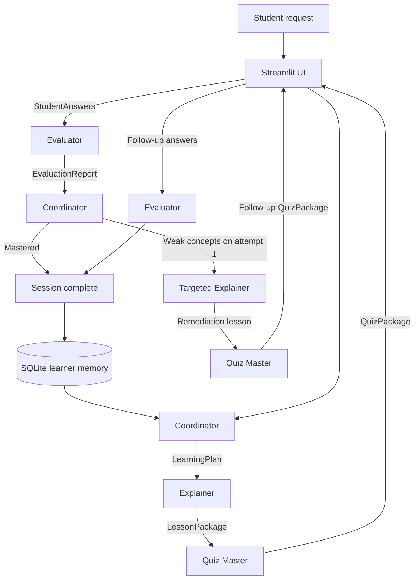

<div align="center">

# Leo — Adaptive Multi-Agent AI Tutor

**A complete learning session designed by four collaborating AI specialists.**

Leo plans, teaches, quizzes, evaluates, and re-teaches—not as one chatbot, but as an observable CrewAI workflow with typed handoffs, persistent learner memory, and deterministic quality controls.

[](https://www.python.org/)
[](https://www.crewai.com/)
[](https://streamlit.io/)
[](https://ai.google.dev/)
[](https://github.com/MdAsif-Hossain/Multi-Agent-AI-Tutor/actions/workflows/ci.yml)
[](#testing-and-ci)
[](LICENSE)

[Demo](#demo) · [Highlights](#engineering-highlights) · [Architecture](#architecture) · [Quick start](#quick-start) · [Testing](#testing-and-ci) · [Rubric](#assignment-rubric-coverage)

</div>

## Demo

https://github.com/user-attachments/assets/64483244-c83e-474c-b570-52f426661e86

> A complete session showing visible agent turns, structured handoffs, quiz evaluation, targeted re-teaching, and learner memory. The recording follows the included [3–5 minute demo script](docs/demo-script.md).

## At a glance

| | |
|---|---|
| **Orchestration** | Sequential CrewAI workflow with a conditional remediation loop |
| **Agent team** | Coordinator, Explainer, Quiz Master, and Evaluator |
| **Handoffs** | Validated Pydantic contracts instead of unstructured text |
| **Memory** | Per-student SQLite history injected into future learning plans |
| **Quality control** | Guardrails, deterministic grading, bounded retries, and route enforcement |
| **Interface** | Responsive Streamlit workspace with visible agent activity |
| **Models** | Gemini 3.1 Flash-Lite by default; Groq supported as a fallback |
| **Verification** | 10 automated tests plus Python 3.12 GitHub Actions CI |

## Engineering highlights

| Capability | Implementation | Why it matters |
|---|---|---|
| **Real multi-agent collaboration** | CrewAI tasks pass plan, lesson, quiz, and evaluation context forward | Each specialist consumes another agent's validated work |
| **Typed boundaries** | `LearningPlan`, `LessonPackage`, `QuizPackage`, `EvaluationReport`, and `RoutingDecision` | Malformed handoffs fail early instead of silently corrupting the session |
| **Deterministic control layer** | Python recalculates scores and enforces the remediation threshold | Final learning decisions do not depend only on model judgment |
| **Adaptive feedback loop** | Weak concepts trigger a shorter lesson and two fresh follow-up questions | The system responds to evidence from the student's answers |
| **Persistent personalization** | SQLite stores scores, strengths, and weak concepts by student | Previous sessions influence future Coordinator prompts |
| **Human-in-the-loop pacing** | The student explicitly releases the Quiz Master after reviewing the lesson | The learner can pause and control progression |
| **Recruiter-safe preview** | Deterministic preview mode runs without an API key | Reviewers can inspect the complete product flow without credentials |

## Product experience

| Adaptive lesson | Evaluation and feedback loop |
|---|---|
|  |  |

The interface exposes high-level agent activity and handoffs while keeping private answer keys, scoring guides, and model reasoning out of the student view.

## Agent team

Each agent has its own role, goal, backstory, behavioral boundary, and output contract.

| Agent | Receives | Produces | Boundary |
|---|---|---|---|
| **Coordinator** | Student profile, topic, prior memory, or evaluation evidence | `LearningPlan` and `RoutingDecision` | Plans and routes; does not teach or grade |
| **Explainer** | Validated `LearningPlan` | `LessonPackage` | Teaches delegated objectives; does not score |
| **Quiz Master** | Plan and completed lesson | `QuizPackage` with private answer-key metadata | Tests only taught concepts; does not evaluate |
| **Evaluator** | Lesson, quiz rubric, and student answers | `EvaluationReport` | Awards evidence-based credit; does not introduce new material |

Role prompts are defined in [`agents.yaml`](src/leo/config/agents.yaml), and task-specific templates are defined in [`tasks.yaml`](src/leo/config/tasks.yaml).

## Architecture

Leo uses **sequential orchestration with a conditional feedback loop**. CrewAI manages the specialist tasks; Pydantic validates their outputs; Python owns scoring, routing, persistence, and UI state.



### Typed handoff chain

```text
StudentProfile + prior memory
    → LearningPlan
    → LessonPackage
    → QuizPackage
    → StudentAnswers
    → EvaluationReport
    → RoutingDecision
```

Question IDs remain stable from quiz generation through evaluation. The student-facing payload excludes `correct_answer`, `explanation`, and `scoring_guide`, while the Evaluator receives the complete private rubric.

### Orchestration controls

- `Process.sequential` preserves a clear, auditable task order.
- `output_pydantic` validates every structured agent result.
- Quiz guardrails require exactly four initial questions (`Q1`–`Q4`) and two remediation questions (`R1`–`R2`).
- Evaluation coverage requires one result for every source question.
- Each agent is limited to four iterations and 120 seconds per execution.
- Structured-output tasks receive at most two guardrail retries.
- The feedback loop is capped at two attempts.

## Adaptive learning loop

An initial score below 70%, or remaining weak concepts, triggers one targeted remediation cycle:

```text
Evaluator identifies weak concepts
    → Coordinator enforces re-teaching
    → Explainer teaches only the identified gaps
    → Quiz Master creates two new questions
    → Evaluator checks the second attempt
    → Session completes and memory is updated
```

`finalize_evaluation()` recalculates totals from the source quiz, and `required_route()` enforces the learning threshold. This keeps grading and routing consistent even when an LLM returns an incorrect total or recommendation.

## Learner memory

Leo stores a compact session summary in local SQLite:

- Student name and selected level
- Topic and learning goal
- Final score
- Mastered concepts
- Weak concepts
- Session timestamp

The Coordinator receives the three most recent summaries as prompt context. Names are matched case-insensitively, so returning students receive continuity without creating duplicate profiles.

## Reliability and safety

| Risk | Control |
|---|---|
| Malformed agent output | Pydantic validation and bounded guardrail retries |
| Duplicate or missing quiz items | Exact-count guardrails and unique question-ID validation |
| Incomplete evaluation | Coverage guardrail aligned to the source quiz |
| Incorrect model-generated totals | Deterministic score normalization in Python |
| Unsafe or inconsistent routing | Deterministic 70% threshold and maximum-attempt enforcement |
| Redundant clarification | Collected level and goal resolve questions already answered by the form |
| Stalled agent execution | Iteration and execution-time limits |
| Accidental answer-key exposure | Separate public quiz payload |
| Credential leakage | Environment-only keys; `.env` and runtime data are ignored by Git |
| Misleading offline demo | Preview mode is visibly separated from live CrewAI mode |

## Technology

| Layer | Technology |
|---|---|
| Agent framework | CrewAI |
| LLM providers | Gemini API; Groq fallback through LiteLLM |
| Interface | Streamlit |
| Contracts and validation | Pydantic |
| Prompt configuration | YAML |
| Learner memory | SQLite |
| Testing | Pytest and Streamlit AppTest |
| Automation | GitHub Actions |

Compatible dependency ranges are maintained in [`requirements.txt`](requirements.txt).

## Quick start

### Prerequisites

- Python 3.12
- A Gemini API key for live mode; no key is required for preview mode

### 1. Clone and create an environment

```bash
git clone https://github.com/MdAsif-Hossain/Multi-Agent-AI-Tutor.git
cd Multi-Agent-AI-Tutor
python -m venv .venv
```

Activate it:

```powershell
# Windows PowerShell
.\.venv\Scripts\Activate.ps1
```

```bash
# macOS or Linux
source .venv/bin/activate
```

### 2. Install dependencies

```bash
pip install -r requirements.txt
```

### 3. Configure live mode

Copy `.env.example` to `.env`, then add your key:

```env
LEO_MODEL=gemini/gemini-3.1-flash-lite
GEMINI_API_KEY=your_key_here
```

Create a Gemini key in [Google AI Studio](https://aistudio.google.com/app/apikey).

Optional Groq configuration:

```env
LEO_MODEL=groq/openai/gpt-oss-120b
GROQ_API_KEY=your_key_here
```

Never commit `.env`; it is already excluded by [`.gitignore`](.gitignore).

### 4. Run Leo

```bash
streamlit run app.py
```

Open `http://localhost:8501`.

### Preview without an API key

Leave **Preview without an API key** enabled in the sidebar. Preview mode uses deterministic sample content so reviewers can inspect the interface, handoff timeline, grading dashboard, and remediation loop without making an LLM call.

For the recorded assignment demo, use live mode with Gemini.

### Environment variables

| Variable | Purpose | Default |
|---|---|---|
| `LEO_MODEL` | CrewAI model identifier | `gemini/gemini-3.1-flash-lite` |
| `GEMINI_API_KEY` | Gemini live-mode credential | — |
| `GROQ_API_KEY` | Groq fallback credential | — |
| `LEO_DB_PATH` | SQLite learner-memory location | `data/leo.db` |

## Testing and CI

Install the development requirements and run:

```bash
pip install -r requirements-dev.txt
pytest -q
```

The 10-test suite covers:

- Pydantic quiz constraints and unique IDs
- Deterministic grading totals and route enforcement
- Redundant-clarification recovery
- All four preview-mode agent handoffs
- Real CrewAI sequential wiring with provider calls mocked
- Gemini and Groq provider initialization
- Case-insensitive persistent learner memory
- A complete Streamlit session through remediation and final evaluation

The [`quality`](.github/workflows/ci.yml) workflow runs on every push and pull request. It installs Python 3.12 dependencies, compiles `app.py` and `src`, and executes the keyless test suite.

## Project structure

```text
.
├── app.py                       # Streamlit interface and session state
├── src/leo/
│   ├── engine.py                # CrewAI orchestration and preview adapter
│   ├── models.py                # Typed handoffs, grading, and routing rules
│   ├── storage.py               # SQLite learner memory
│   └── config/
│       ├── agents.yaml          # Role prompts and behavioral boundaries
│       └── tasks.yaml           # Task templates and expected outputs
├── tests/
│   ├── test_workflow.py         # Contracts, orchestration, memory, providers
│   └── test_app.py              # End-to-end Streamlit workflow
├── docs/
│   ├── screenshots/             # Portfolio interface evidence
│   └── demo-script.md           # Timed recording plan
├── .github/workflows/ci.yml
├── .env.example
└── requirements.txt
```

## Assignment rubric coverage

| Criterion | Implementation evidence |
|---|---|
| **4+ distinct agents** | Four agents with separate prompts, responsibilities, inputs, outputs, and boundaries |
| **Orchestration and handoffs** | Sequential CrewAI tasks with validated plan → lesson → quiz → evaluation context |
| **Framework** | CrewAI `Agent`, `Task`, `Crew`, `Process.sequential`, `LLM`, callbacks, and guardrails |
| **Memory and prompt templates** | SQLite learner history plus per-role and per-task YAML templates |
| **Final output quality** | Coherent lesson, structured practice, rubric feedback, and targeted remediation |
| **Interface** | Responsive Streamlit dashboard with visible agent activity |
| **Code and README** | Modular source, architecture diagram, setup guide, tests, CI, screenshots, and license |
| **Demo video** | Native GitHub video player at the top of this README |
| **Bonus** | Evaluator-driven re-teaching loop and student-controlled checkpoint |

## Scope and limitations

- AI-generated lessons and evaluations can be wrong; important academic information should be verified with trusted sources.
- SQLite memory is intentionally local and suited to a single-machine demonstration. A multi-user deployment should use an external managed database.
- Preview mode demonstrates product behavior and presentation, not live-model quality.
- Web search is intentionally excluded from the first release to keep the assessed workflow focused and auditable.

## License

Released under the [MIT License](LICENSE). Copyright © 2026 Md Asif Hossain.
